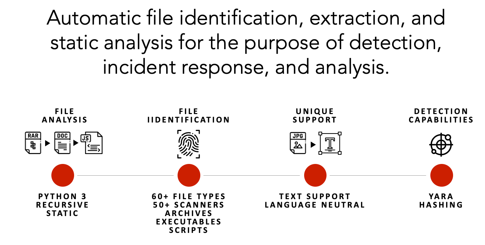
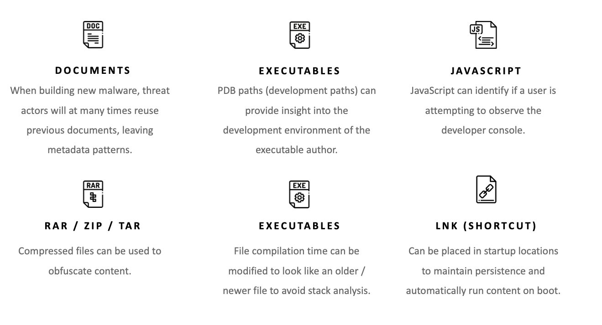

<h1 align="center">
  
</h1>

<div align="center">

[Releases][release]&nbsp;&nbsp;&nbsp;|&nbsp;&nbsp;&nbsp;[Documentation][wiki]&nbsp;&nbsp;&nbsp;|&nbsp;&nbsp;&nbsp;[Pull Requests][pr]&nbsp;&nbsp;&nbsp;|&nbsp;&nbsp;&nbsp;[Issues][issues]

[![GitHub release][img-version-badge]][repo] [![Build Status][img-actions-badge]][actions-ci] [![Pull Requests][img-pr-badge]][pr] [![Slack][img-slack-badge]][slack]  [![License][img-license-badge]][license]

</div>

Strelka is a real-time, container-based file scanning system used for threat hunting, threat detection, and incident response. Originally based on the design established by Lockheed Martin's [Laika BOSS](https://github.com/lmco/laikaboss) and similar projects (see: [related projects](#related-projects)), Strelka's purpose is to perform file extraction and metadata collection at enterprise scale.

Strelka differs from its sibling projects in a few significant ways:
* Core codebase is Go and Python3.10+
* Server components run in containers for ease and flexibility of deployment
* OS-native client applications for Windows, Mac, and Linux
* Built using [libraries and formats](#architecture) that allow cross-platform, cross-language support

## Features
Strelka is a modular data scanning platform, allowing users or systems to submit files for the purpose of analyzing, extracting, and reporting file content and metadata. Coupled with a [SIEM](https://en.wikipedia.org/wiki/Security_information_and_event_management), Strelka is able to aggregate, alert, and provide analysts with the capability to better understand their environment without having to perform direct data gathering or time-consuming file analysis.



## Quickstart

Running a file through Strelka is simple. In this section, Strelka capabilities of extraction and analysis are demonstrated for a one-off analysis.

*Please review the [documentation](https://target.github.io/strelka/) for details on how to properly build and deploy Strelka in an enterprise environment.*

#### Step 1: Install prerequisites

```bash
# Ubuntu 23.04
sudo apt install -y wget git docker docker-compose golang jq && \
sudo usermod -aG docker $USER && \
newgrp docker
````

#### Step 2: Download Strelka

```bash
git clone https://github.com/target/strelka.git && \
cd strelka
```

#### Step 3: Download and install preferred yara rules (optional)

```bash
rm configs/python/backend/yara/rules.yara && \
git clone https://github.com/Yara-Rules/rules.git configs/python/backend/yara/rules/ && \
echo 'include "./rules/index.yar"' > configs/python/backend/yara/rules.yara
```

#### Step 4a: Pull precompiled images and start Strelka
**Note**: You can skip the `go build` process and use the `Strelka UI` at `http://0.0.0.0:9980` to analyze files.

```bash
docker compose -f build/docker-compose-no-build.yaml up -d && \
go build github.com/target/strelka/src/go/cmd/strelka-oneshot
```

#### Step 4b: Build and start Strelka
**Note**: You can skip the `go build` process and use the `Strelka UI` at `http://0.0.0.0:9980` to analyze files.

```bash
docker compose -f build/docker-compose.yaml build && \
docker compose -f build/docker-compose.yaml up -d && \
go build github.com/target/strelka/src/go/cmd/strelka-oneshot
```

#### Step 5: Prepare a file to analyze

Use any malware sample, or other file you'd like Strelka to analyze.

```bash
wget https://github.com/ytisf/theZoo/raw/master/malware/Binaries/Win32.Emotet/Win32.Emotet.zip -P samples/
```

#### Step 6: Analyze the file with Strelka using the dockerized oneshot

```bash
./strelka-oneshot -f samples/Win32.Emotet.zip -l - | jq
```

#### What's happening here?

1. Strelka determined that the submitted file was an encrypted ZIP (See: [taste.yara](configs/python/backend/taste/taste.yara) [backend.yaml](configs/python/backend/backend.yaml))
2. [ScanEncryptedZip](src/python/strelka/scanners/scan_encrypted_zip.py) used a dictionary to crack the ZIP file password, and extract the compressed file
3. The extracted file was sent back into the Strelka pipeline by the scanner, and Strelka determined that the extracted file was an EXE
4. [ScanPe](src/python/strelka/scanners/scan_pe.py) dissected the EXE file and added useful metadata to the output
5. [ScanYara](src/python/strelka/scanners/scan_yara.py) analyzed the EXE file, using the provided rules, and added numerous matches to the output, some indicating the file might be malicious

*The following output has been edited for brevity.*

```json
{
  "file": {
    "depth": 0,
    "flavors": {
      "mime": ["application/zip"],
      "yara": ["encrypted_zip", "zip_file"]
    },
    "scanners": [
      "ScanEncryptedZip",
      "ScanEntropy",
      "ScanFooter",
      "ScanHash",
      "ScanHeader",
      "ScanYara",
      "ScanZip"
    ]
  },
  "scan": {
    "encrypted_zip": {
      "cracked_password": "infected",
      "elapsed": 0.114269,
      "total": {"extracted": 1, "files": 1}
    }
  }
}
```
```json
{
  "file": {
    "depth": 1,
    "flavors": {
      "mime": ["application/x-dosexec"],
      "yara": ["mz_file"]
    },
    "name": "29D6161522C7F7F21B35401907C702BDDB05ED47.bin",
    "scanners": [
      "ScanEntropy",
      "ScanFooter",
      "ScanHash",
      "ScanHeader",
      "ScanPe",
      "ScanYara"
    ]
  },
  "scan": {
    "pe": {
      "address_of_entry_point": 5168,
      "base_of_code": 4096,
      "base_of_data": 32768,
      "checksum": 47465,
      "compile_time": "2015-03-31T08:53:51",
      "elapsed": 0.013076,
      "file_alignment": 4096,
      "file_info": {
        "company_name": "In CSS3",
        "file_description": "Note: In CSS3, the text-decoration property is a shorthand property for text-decoration-line, text-decoration-color, and text-decoration-style, but this is currently.",
        "file_version": "1.00.0065",
        "fixed": {"operating_systems": ["WINDOWS32"]},
        "internal_name": "Callstb",
        "original_filename": "NOFAstb.exe",
        "product_name": "Goodreads",
        "product_version": "1.00.0065",
        "var": {"character_set": "Unicode", "language": "U.S. English"}
      }
    },
    "yara": {
      "elapsed": 0.068918,
      "matches": [
        "SEH__vba",
        "SEH_Init",
        "Big_Numbers1",
        "IsPE32",
        "IsWindowsGUI",
        "HasOverlay",
        "HasRichSignature",
        "Microsoft_Visual_Basic_v50v60",
        "Microsoft_Visual_Basic_v50",
        "Microsoft_Visual_Basic_v50_v60",
        "Microsoft_Visual_Basic_v50_additional",
        "Microsoft_Visual_Basic_v50v60_additional"
      ],
      "tags": [
        "AntiDebug",
        "SEH",
        "Tactic_DefensiveEvasion",
        "Technique_AntiDebugging",
        "SubTechnique_SEH",
        "PECheck",
        "PEiD"
      ]
    }
  }
}
```

#### What's next?

If Strelka was deployed and ingesting files in your environment, you might be collecting these events in your SIEM. With this analysis, you could write a rule that looks for events matching the suspicious yara tags, alerting you to a potentially malicious file.

```
scan.yara.tags:("Technique_AntiDebugging" && "SubTechnique_SEH")
```

## Fileshot UI

[Strelka's UI](https://github.com/target/strelka-ui) is available when you build the provided containers. This web interface allows you to upload files to Strelka and capture the events, which are stored locally.

Navigate to http://localhost:9980/ and use the login strelka/strelka.


## Potential Uses
With over 50 file scanners for the most common file types (e.g., exe, docx, js, zip), Strelka provides users with the ability to gain new insights into files on their host, network, or enterprise. While Strelka *is not* a detection engine itself (although it does utilize [YARA](https://virustotal.github.io/yara/), it can provide enough metadata to identify suspicious or malicious files. Some potential uses for Strelka include:



## Additional Documentation
More documentation about Strelka can be found in the [README](https://target.github.io/strelka/), including:
- [Installation](https://target.github.io/strelka/#/?id=installation)
- [Deployment](https://target.github.io/strelka/#/?id=deployment)
- [Design](https://target.github.io/strelka/#/?id=design)
- [Architecture](https://target.github.io/strelka/#/?id=architecture)
- [FAQ](https://target.github.io/strelka/#/?id=frequently-asked-questions)

## Contribute
Guidelines for contributing can be found [here](https://github.com/target/strelka/blob/master/CONTRIBUTING.md).

## Known Issues


### Issues with Loading YARA Rules
Users are advised to precompile their YARA rules for optimal performance and to avoid potential issues during runtime. 
Using precompiled YARA files helps in reducing load time and resource usage, especially in environments with a large 
set of rules. Ensure to use the [compiled option in the Strelka configuration](https://github.com/target/strelka/blob/master/configs/python/backend/backend.yaml) 
to point to the precompiled rules file. 

### Other Issues
See [issues labeled `bug`](https://github.com/target/strelka/issues?q=is%3Aissue+is%3Aopen+label%3Abug) in the tracker for any additional issues.

## Related Projects
* [Laika BOSS](https://github.com/lmco/laikaboss)
* [File Scanning Framework](https://github.com/EmersonElectricCo/fsf)
* [Assemblyline](https://cybercentrecanada.github.io/assemblyline4_docs/)

## Licensing
Strelka and its associated code is released under the terms of the [Apache 2.0 License](https://github.com/target/strelka/blob/master/LICENSE).

<div align="center">
  
</div>

<!--
Links
-->
[release]:https://github.com/target/strelka/releases/latest "Strelka Latest Release ➶"
[issues]:https://github.com/target/strelka/issues "Strelka Issues ➶"
[pull-requests]:https://github.com/target/strelka/pulls "Strelka Pull Requests ➶"
[wiki]:https://target.github.io/strelka/#/ "Strelka Documentation ➶"
[repo]:https://github.com/target/strelka "Strelka Repository ➶"
[slack]:https://join.slack.com/t/cfc-open-source/shared_invite/zt-e54crchh-a6x4iDy18D5lVwFKQoEeEQ "Slack (external link) ➶"
[actions-ci]:https://github.com/target/strelka/actions/workflows/build_strelka_nightly.yml "Github Actions ➶"
[pr]:https://github.com/target/strelka/pulls "Strelka Pull Requests ➶"
[license]:https://github.com/target/strelka/blob/master/LICENSE "Strelka License File ➶"
[docker]:https://www.docker.com/ "Docker (external link) ➶"

<!--
Badges
-->
[img-version-badge]:https://img.shields.io/github/release/target/strelka.svg?style=for-the-badge
[img-slack-badge]:https://img.shields.io/badge/slack-join-red.svg?style=for-the-badge&logo=slack
[img-actions-badge]:https://img.shields.io/github/actions/workflow/status/target/strelka/build_strelka_nightly.yml?branch=master&style=for-the-badge
[img-pr-badge]:https://img.shields.io/badge/PRs-welcome-orange.svg?style=for-the-badge&logo=data%3Aimage%2Fsvg%2Bxml%3Bbase64%2CPD94bWwgdmVyc2lvbj0iMS4wIiBlbmNvZGluZz0iVVRGLTgiPz48c3ZnIGlkPSJzdmcyIiB3aWR0aD0iNjQ1IiBoZWlnaHQ9IjU4NSIgdmVyc2lvbj0iMS4wIiB4bWxucz0iaHR0cDovL3d3dy53My5vcmcvMjAwMC9zdmciPiA8ZyBpZD0ibGF5ZXIxIj4gIDxwYXRoIGlkPSJwYXRoMjQxNyIgZD0ibTI5Ny4zIDU1MC44N2MtMTMuNzc1LTE1LjQzNi00OC4xNzEtNDUuNTMtNzYuNDM1LTY2Ljg3NC04My43NDQtNjMuMjQyLTk1LjE0Mi03Mi4zOTQtMTI5LjE0LTEwMy43LTYyLjY4NS01Ny43Mi04OS4zMDYtMTE1LjcxLTg5LjIxNC0xOTQuMzQgMC4wNDQ1MTItMzguMzg0IDIuNjYwOC01My4xNzIgMTMuNDEtNzUuNzk3IDE4LjIzNy0zOC4zODYgNDUuMS02Ni45MDkgNzkuNDQ1LTg0LjM1NSAyNC4zMjUtMTIuMzU2IDM2LjMyMy0xNy44NDUgNzYuOTQ0LTE4LjA3IDQyLjQ5My0wLjIzNDgzIDUxLjQzOSA0LjcxOTcgNzYuNDM1IDE4LjQ1MiAzMC40MjUgMTYuNzE0IDYxLjc0IDUyLjQzNiA2OC4yMTMgNzcuODExbDMuOTk4MSAxNS42NzIgOS44NTk2LTIxLjU4NWM1NS43MTYtMTIxLjk3IDIzMy42LTEyMC4xNSAyOTUuNSAzLjAzMTYgMTkuNjM4IDM5LjA3NiAyMS43OTQgMTIyLjUxIDQuMzgwMSAxNjkuNTEtMjIuNzE1IDYxLjMwOS02NS4zOCAxMDguMDUtMTY0LjAxIDE3OS42OC02NC42ODEgNDYuOTc0LTEzNy44OCAxMTguMDUtMTQyLjk4IDEyOC4wMy01LjkxNTUgMTEuNTg4LTAuMjgyMTYgMS44MTU5LTI2LjQwOC0yNy40NjF6IiBmaWxsPSIjZGQ1MDRmIi8%2BIDwvZz48L3N2Zz4%3D
[img-license-badge]:https://img.shields.io/badge/license-apache-ff69b4.svg?style=for-the-badge&logo=apache
[img-docker-badge]:https://img.shields.io/badge/Supports-Docker-yellow.svg?style=for-the-badge&logo=docker
